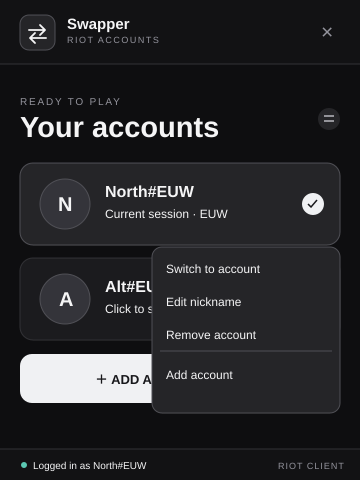
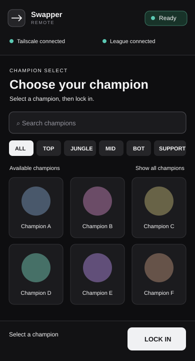

# Swapper

Swapper is a free Windows tray app for switching between saved Riot Client sign-ins. It uses the official Riot Client for sign-in and never asks for your password. A companion page on your phone can follow League's queue and champion select through your own Tailscale network.

## Download

Download the Windows installer from the [latest GitHub release](https://github.com/Phamezan/Swapper/releases/latest). Exit an older Swapper from the tray before installing the update. The installer is currently unsigned, so Windows may ask you to confirm that you trust it. Swapper stores its settings and encrypted sessions under `%LOCALAPPDATA%\Swapper`; reinstalling the app does not remove them.

## Features

- Save multiple Riot Client sign-ins and switch between them from the tray flyout. Swapper closes Riot and League client processes before restoring the selected session; it refuses to switch while a game is running.
- Detect the signed-in Riot account automatically and avoid duplicate entries using Riot's account identifier. Give saved accounts optional nicknames and remove them from the tray app.
- Optionally launch the selected account through the bundled [Deceive](https://github.com/molenzwiebel/Deceive) executable to use Deceive's presence behavior.
- Use your phone, over [Tailscale Serve](https://tailscale.com/docs/features/tailscale-serve), to watch queue time, accept a match, prepick, ban, pick, and lock in a champion. Champion search, role filters, and icons are supplied by the running League client.
- Show a copyable remote link and QR code in Settings. Remote control works while Swapper, Tailscale, and League Client are running on the PC.

## Preview

These illustrations use sample account names and show the tray flyout and phone layout. The phone view changes with the League client phase.

| Windows tray flyout | Phone remote control |
| --- | --- |
|  |  |

## Add and switch accounts

1. Open Swapper. Right-click its tray icon and choose **Add Account**, or open the flyout and choose **Add account**.
2. Sign in through the official Riot Client with **Stay signed in** selected. League does not need to be open. Swapper detects the Riot account, then offers **Save Account**. If that same account is already saved, it offers **Update Saved Account**.
3. Left-click the Swapper tray icon to open your accounts. Left-click an account to switch. Right-click an account for **Switch to account**, **Edit nickname**, **Remove account**, and **Add account**. Removing an account asks for confirmation.

Do not use Riot Client's **Sign out** between saved accounts; it can invalidate a session that Swapper needs to restore. Use Swapper's **Sign in to another account** flow. If a saved session expires, sign back into that same account in Riot Client and update its saved session. Accounts created by older Swapper builds without a stored account identifier cannot be verified automatically; save a new verified entry before removing the old one.

## Phone remote control with Tailscale

1. Follow [Tailscale's quickstart](https://tailscale.com/docs/how-to/quickstart) to install Tailscale on the Windows PC and your phone. Sign both devices into the same tailnet. See Tailscale's [Windows installation guide](https://tailscale.com/docs/install/windows) if needed.
2. Enable [MagicDNS and HTTPS certificates](https://tailscale.com/docs/how-to/set-up-https-certificates) for your tailnet. Swapper uses [Tailscale Serve](https://tailscale.com/docs/features/tailscale-serve) to expose its local page to devices allowed by your tailnet policy. Swapper does not use Funnel or make the page public on the internet.
3. In Swapper **Settings**, turn on **Remote Control**. Open the displayed link on your phone, or scan the QR code. Keep Tailscale connected on both devices.
4. Open League Client on the PC. The phone page shows connection status and the queue timer. At ready check you can accept the match; during champion select you can prepick, ban, pick, and lock in when League allows those actions.

Anyone permitted by your tailnet's access rules to reach this Serve route can use the page; Swapper does not add a separate pairing code. See Tailscale's [Serve access guidance](https://tailscale.com/docs/features/tailscale-serve) if you share a tailnet. Account switching itself remains in the Windows tray app.

## Privacy and storage

Swapper stores account names, Riot account identifiers, settings, and references to encrypted session snapshots in `%LOCALAPPDATA%\Swapper`. Session snapshots are encrypted with Windows DPAPI for the current Windows user and are not sent to the phone or a Swapper server. Riot's own live client files remain under `%LOCALAPPDATA%\Riot Games`. Copying a vault to a different Windows account generally will not make it usable there.

Swapper reads the local Riot and League clients to identify a signed-in account and provide remote controls. It does not request passwords or use a Riot developer API key. Riot may change its clients independently, so a future client update can require a Swapper update.

## Open-source credits and licenses

- [TcNo Account Switcher](https://github.com/TCNOco/TcNo-Acc-Switcher) inspired the account-switching flow and informed the session-path allowlist. Swapper is an independent Riot-focused implementation; TcNo is not bundled.
- [Mimic](https://github.com/molenzwiebel/Mimic) inspired the phone-based League lobby and champion-select controls. Mimic is not bundled.
- [Deceive v1.18.0](https://github.com/molenzwiebel/Deceive/releases/tag/v1.18.0) is bundled as an **unmodified, separate executable**. Deceive is GPL-3.0 licensed; its [license](src-tauri/resources/Deceive-LICENSE.txt) and [source information](src-tauri/resources/Deceive-SOURCE.txt) ship with Swapper. Swapper does not claim authorship of Deceive.
- [Accshift](https://github.com/klNuno/accshift) was another reference for Riot session paths; it is not bundled.

Swapper's own source code is licensed under the [MIT License](LICENSE). That license does not relicense Deceive, Riot-owned content, or other third-party software.

## Development

Requires Windows, Node.js, Rust with the MSVC toolchain, and the [Tauri 2 Windows prerequisites](https://v2.tauri.app/start/prerequisites/).

```powershell
npm ci
npm run tauri dev
```

`npm run build` checks and bundles the frontend. `cargo test --manifest-path src-tauri/Cargo.toml --locked` runs native tests. To make a Windows installer locally, run `npm run tauri -- build`; a release also needs a manual test with Riot Client and multiple accounts.

## Contributing

Bug reports, documentation fixes, and code contributions are welcome. For a bug, open a GitHub issue with the Swapper version, Windows version, steps to reproduce, and what happened. Remove Riot account identifiers, session files, access tokens, and other private data from screenshots and logs before sharing them.

For code changes, open an issue first if the change is substantial, then work on a focused branch and submit a pull request. Explain the behavior you changed and how you tested it. Run `npm run build` and `cargo test --manifest-path src-tauri/Cargo.toml --locked` locally; for Riot Client, League Client, account switching, or phone remote changes, include the manual scenarios you tested. Automated GitHub checks may not run on every pull request, so include your local results.

---

Swapper was created under Riot Games' ["Legal Jibber Jabber" policy](https://www.riotgames.com/en/legal) using assets owned by Riot Games. Riot Games does not endorse or sponsor this project.
